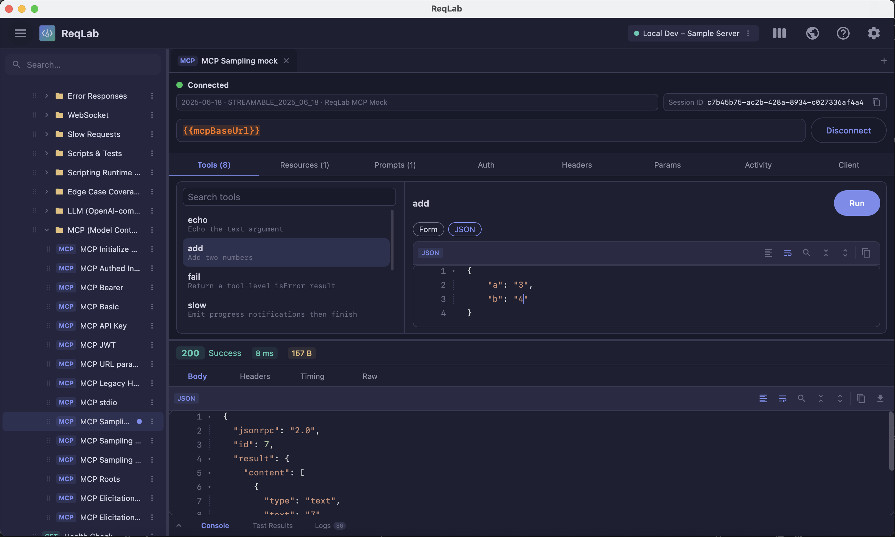

# MCP in ReqLab

ReqLab is an [MCP](https://modelcontextprotocol.io/) client in the same workspace as REST: collections, environments, `{{variables}}`, auth, and a shared Response pane. You save an MCP connection, Connect, then call tools, read resources, and fill prompts — with the JSON-RPC session visible when you need to debug.

This page is the product guide. The local mock server, PATH shim, and e2e commands live in [DEVELOPMENT.md](../DEVELOPMENT.md) and [docs/tests.md](tests.md).

---

## What you can do

| Area | In the workspace |
|---|---|
| Transports | Streamable HTTP (MCP 2025-06-18), Auto (Streamable first, legacy fallback), Legacy HTTP+SSE (2024-11-05), desktop stdio |
| Session | Connected / Connecting / Error / Disconnected; Connect, Disconnect, Reconnect; protocol · HTTP mode · server name; session id with copy |
| Tools | Searchable list, Form or JSON arguments, required-field gating, read-only / destructive chips, Run / Stop |
| Resources | Search, Read, Subscribe / Unsubscribe when the server advertises it; updates re-read into Response |
| Prompts | Search, Form or JSON arguments, Get prompt; rendered messages in Response |
| Auth | None, Basic, Bearer, API Key, JWT — same editors as REST. `{{var}}` in URL, command, headers, and auth |
| Headers / Params | Same key/value tables as REST; query params stay in sync with the URL |
| Activity | Per-session JSON-RPC inspector (SENT / RECEIVED / NOTIFICATION / STATE / ERROR), expand payload, copy, Clear |
| Logs | Bottom **Logs** tab: one-line MCP summaries. **Console** is scripts and app messages only |
| Client callbacks | Sampling (mock or review + optional LLM), roots list, elicitation form, ping (always handled) |
| Persistence | Collection item `kind: MCP`; import/export of transport, HTTP mode, headers, auth, roots, sampling, elicitation |

The Response pane is the same viewer as REST (status, timing, size, pretty JSON). Nested JSON stored as a string is unwrapped for display. MCP responses have no cookie jar, so the Cookies tab is omitted.

---

## Workspace tour

1. Add an MCP connection from the sidebar (**Add → MCP connection**) or open a collection item with the **MCP** badge.
2. On the **Client** tab, choose **HTTP** or **stdio** (stdio is desktop-only). For HTTP, pick **Auto**, **2025-06-18**, or **Legacy**.
3. Put the URL or command in the top bar (`{{variable}}` interpolation, same as REST).
4. Confirm stdio if prompted — ReqLab starts a local process.
5. Click **Connect**. Status goes Connecting → Connected (or Error). The session stays up when you switch tabs and disconnects when you close the MCP tab.
6. When connected, the bar shows the negotiated protocol, HTTP mode, and server name, plus a **Session ID** (a UUID shows in full; longer ids truncate with `…`). Copy copies the complete id.
7. Use **Tools**, **Resources**, and **Prompts**. `⌘/Ctrl+Enter` runs or stops the selected tool, resource read, or prompt — not only tools. Results open in Response.

Reconnect if Client-tab settings change while you are connected (transport, URL/command, auth, headers, sampling, LLM, roots, elicitation).

---

## Tools

Pick a tool, fill arguments, Run. The screenshot is a connected Streamable HTTP session calling `add` with JSON arguments; the Response body is the JSON-RPC result.

- Tab label includes the tool count. Search filters by name and description. Drag the list/detail split.
- **Form** builds arguments from the JSON Schema (string, number, boolean, enum). **JSON** is a raw editor. Required fields must be filled before Run is enabled.
- Tools may show **Read-only** or **Destructive** chips from server annotations.
- **Run** / **Stop** sit on the tool pane. Stop cancels the in-flight call in ReqLab (it does not send a protocol cancel notification).
- Success and tool errors use the shared Response viewer.

Try it locally: start the sample server (`./gradlew :sample-server:run`), import the test collection, open an MCP item, Connect, select a tool, Run. Mock URLs and tools are listed in [DEVELOPMENT.md](../DEVELOPMENT.md).

---

## Resources

- Search the list, select a resource, **Read**. Contents appear in Response.
- If the server advertises `resources.subscribe`, **Subscribe** asks it to notify on change. ReqLab re-reads subscribed URIs on `notifications/resources/updated` and shows the new contents in Response. **Unsubscribe** stops that.

---

## Prompts

- Search, select a prompt, fill arguments (Form or JSON), **Get prompt**.
- Rendered messages open in Response.

---

## Activity, Logs, and Console

Three different surfaces:

| Surface | What it is |
|---|---|
| **Activity** (MCP tab) | Every JSON-RPC message for this session: SENT, RECEIVED, NOTIFICATION, STATE, ERROR. Click a row to expand the pretty payload; copy copies that JSON. **Clear** empties this list only. |
| **Logs** (bottom bar) | One-line MCP summaries for the app (connect, sent/received, errors). |
| **Console** (bottom bar) | Script `console.log` and app messages. MCP wire traffic is not echoed here. |

Use Activity when you need the payload; use Logs for a compact trail.

---

## Client tab: how ReqLab answers the server

Servers may call **back** into the client. Settings are stored on the tab and round-trip in collection JSON.

### Connection

- **Transport**: HTTP or stdio.
- **HTTP mode** (HTTP only): Auto, 2025-06-18, Legacy.

### Server callbacks

| Setting | Behavior |
|---|---|
| Auto-respond sampling **on** | Silent mock reply (`mock reply from ReqLab`). |
| Auto-respond sampling **off** | Response pane: review `sampling/createMessage` → optionally **Approve generate** (LLM URL / token / max tokens) → edit `content`, `role`, `model`, `stopReason` → **Approve send**. Cancel sends `stopReason: cancelled`. Empty URL or a failed generate still opens the editable result. |
| Auto-accept elicitation **on** | Silent `accept`. |
| Auto-accept elicitation **off** | Schema form in Response; Accept or Decline. |

Ping has no switch: ReqLab always answers `ping` with an empty result.

### Roots

URI and optional name rows. ReqLab returns them on `roots/list`. Empty state is “No folders yet” plus Add.

---

## Auth, headers, and params

MCP HTTP connections reuse the REST editors:

- **Auth**: None, Basic, Bearer, API Key, JWT.
- **Headers**: key/value table (secrets supported).
- **Query params**: edit the URL or the params table; they stay in sync.

OAuth 2.1 is not an Auth-tab option yet. If a server expects a bearer token you already have, use **Bearer**.

---

## Transports

| Spec | In ReqLab |
|---|---|
| MCP 2025-06-18 | Streamable HTTP: `POST` JSON-RPC (`Accept: application/json, text/event-stream`). Optional `Mcp-Session-Id`; `DELETE` on disconnect; optional GET SSE after handshake. |
| MCP 2024-11-05 | Legacy HTTP+SSE: `GET` for the `endpoint` event, then `POST` JSON-RPC. Replies are correlated by JSON-RPC `id` on the SSE stream. |
| MCP stdio | Local subprocess, newline-delimited JSON-RPC on stdin/stdout. Desktop only. Stderr is ignored for framing. Confirm before Connect. |

**Auto** tries Streamable HTTP and falls back to legacy when the server indicates it.

HTTP example (test environment): `{{mcpBaseUrl}}` → `http://localhost:8080/mcp`. Legacy: `{{mcpLegacyUrl}}` → `http://localhost:8080/mcp/sse`.

stdio is a **full command line** (executable plus arguments), for example `npx -y @modelcontextprotocol/server-everything` or `sample-server` after the PATH shim. Quoted paths with spaces work. How ReqLab resolves PATH and installs the sample shim: [DEVELOPMENT.md](../DEVELOPMENT.md).

---

## Import / export

MCP tabs persist `kind: MCP`, URL or command, transport, HTTP mode, headers, auth, roots, sampling mode, LLM URL / token / max tokens, and elicitation. Older workspace JSON without those fields still loads (defaults apply).

The desktop import/export file dialog remembers the last folder (macOS, Windows, Linux). Browsers cannot set the `<input type=file>` start directory.

---

## Keyboard shortcuts (MCP)

| Shortcut | Action |
|---|---|
| `⌘ + Enter` / `Ctrl + Enter` | Run or stop the selected tool, resource read, or get-prompt |

Connect / Disconnect is the connection-bar button, not Send.

---

## Try the sample collection

Import [qa-tests/fixtures/reqlab-test-collection.json](../qa-tests/fixtures/reqlab-test-collection.json) and [qa-tests/fixtures/reqlab-test-environment.json](../qa-tests/fixtures/reqlab-test-environment.json). Folder **MCP (Model Context Protocol)** covers Streamable HTTP, auth variants, query params, legacy SSE, stdio, sampling, roots, and elicitation.

Start the mock with `./gradlew :sample-server:run`. Routes, mock tools (`echo`, `add`, `trigger_*`, …), and stdio install: [DEVELOPMENT.md](../DEVELOPMENT.md). How tests assert this: [docs/tests.md](tests.md).

---

## Implementation map

| Area | Location |
|---|---|
| Client, handshake, pending RPC | `core-network` `McpClient` |
| Streamable HTTP / legacy SSE / stdio | `StreamableHttpTransport`, `LegacyHttpSseTransport`, `McpStdio.kt` + `McpPlatform.desktop.kt` |
| Session / UI | `ui-shared` `McpSessionState`, `McpPanel` |
| Mock protocol + HTTP routes | `sample-server` `McpMock`, `McpRoutes` |

Related: [DEVELOPMENT.md](../DEVELOPMENT.md), [docs/tests.md](tests.md), [docs/architecture.md](architecture.md).
